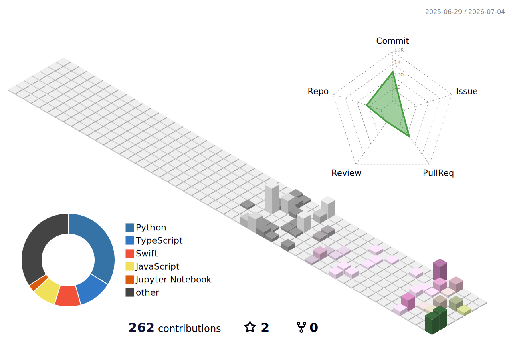

<!-- github-profile-3d-contrib が profile-3d-contrib/ 配下に生成する 3D 貢献グラフ -->

  <picture>
    <source media="(prefers-color-scheme: dark)"  srcset="profile-3d-contrib/profile-night-rainbow.svg" />
    <source media="(prefers-color-scheme: light)" srcset="profile-3d-contrib/profile-season-animate.svg" />
    
  </picture>

